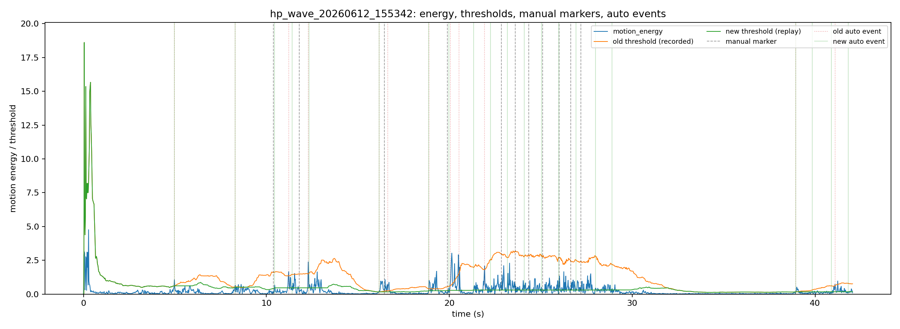
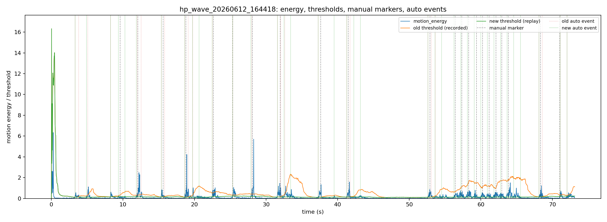
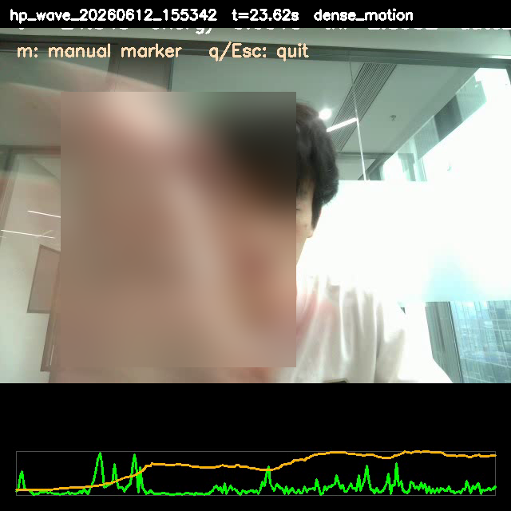
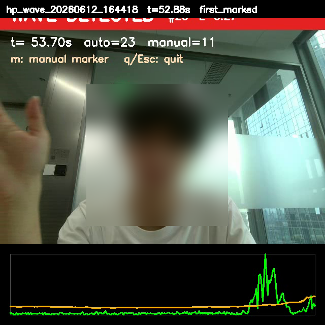

# HP 笔记本声波挥手识别原型

这个目录是一个基于 Python 的实时声波手势识别原型。它使用笔记本扬声器发出近超声单音，使用麦克风接收回波，通过 I/Q 解调得到幅度和相位变化，再用自适应阈值判断是否出现挥手等大幅动作。

当前目标不是直接识别眨眼，而是先把“声波发射 -> 麦克风采集 -> I/Q 特征 -> 动作事件”这条链路跑通。挥手动作幅度更大，适合作为眨眼识别前的第一阶段验证。

## 技术核心

### 1. 主动声学探测

程序持续播放一个单频声波，默认参数是：

| 参数 | 默认值 | 说明 |
| --- | ---: | --- |
| 采样率 | `48000 Hz` | 普通笔记本声卡可用 |
| 发射频率 | `18500 Hz` | 接近超声，减少主观听感 |
| 块大小 | `1024 samples` | 每块约 `21.3 ms` |
| 播放幅度 | `0.02` | 实验中较安全的低音量 |

当手在扬声器和麦克风附近移动时，声波传播路径、反射强度和相位会变化。程序不直接识别图像，而是检测这类声学扰动。

### 2. I/Q 解调

每个音频块都会乘以本地复指数参考信号：

```text
baseband[n] = microphone[n] * exp(-j * 2*pi*f0*n/fs)
```

然后对一个块内的 baseband 求均值，得到复数 I/Q：

```text
I = real(mean(baseband))
Q = imag(mean(baseband))
amplitude = sqrt(I^2 + Q^2)
phase = atan2(Q, I)
```

这里的 I/Q 不是简单画原始波形，而是把目标频率附近的信号搬到基带后观察幅度和相位。这个处理思路和声学感知论文中常见的“主动发声 + 接收端解调 + 观察相位/幅度扰动”一致。

### 3. 运动能量

相邻音频块之间计算：

```text
amplitude_delta = amplitude[t] - amplitude[t-1]
phase_delta = unwrap(phase[t] - phase[t-1])
relative_amp_delta = abs(amplitude_delta) / previous_amplitude
motion_energy = abs(phase_delta) + clipped(relative_amp_delta)
```

这条 `motion_energy` 不是论文中的原始公式，而是本原型为了“先检测大幅挥手动作”设计的工程启发式特征。它的理论依据来自论文中对 I/Q 空间、幅度变化和相位变化的分析：

- BlinkListener 在第 3.2 节 `Modeling the Eye Blink Process` 中从 I-Q vector space 分析眼动信号，指出路径长度变化主要带来 phase change，反射表面变化会带来 amplitude change；并进一步指出 blink-induced signal variation 具有“小相位变化、大幅度变化”的特点。
- BlinkListener 第 6.3 节 `Real-time Eye Blink Detection` 使用时域检测，而不是频域周期分析；其 Step 2 用滑动窗口中的局部极值和静止时标准差阈值检测 blink-induced bumps。
- TwinkleTwinkle 第 3.2 节 `Depict Eye Blink Motion Profile` 说明接收信号解调后得到 I/Q baseband signal；第 4.2 节使用 phase pairs / phase subtraction 提取候选 blink motion profiles。

因此，我们这里保留了“幅度扰动 + 相位扰动 + 时域事件检测”的思想，但没有复现 BlinkListener 的 viewing position / LEVD，也没有复现 TwinkleTwinkle 的 phase-pair trajectory。当前公式只是第一阶段手势原型，用于把可见的大幅声学扰动压缩成单个标量，方便实时阈值检测。

直观理解：

- 相位突变说明传播路径发生变化；
- 幅度突变说明反射强度或遮挡发生变化；
- 二者合成一个 `motion_energy`，作为检测器输入。

## 检测流程

整体流程如下：

```text
扬声器播放 18.5 kHz 单音
        |
麦克风实时采集
        |
按 1024 samples 分块
        |
I/Q 解调
        |
计算 amplitude / phase / motion_energy
        |
滚动 median + MAD 建立静止 baseline
        |
motion_energy > threshold 时触发 WAVE DETECTED
        |
保存 audio.wav / features.csv / events.csv / camera.mp4 / metadata.json
```

检测器使用滚动 median/MAD：

```text
baseline = median(history)
mad = median(abs(history - baseline))
threshold = max(min_energy, baseline + threshold_k * 1.4826 * mad)
```

当前默认参数：

| 参数 | 默认值 | 作用 |
| --- | ---: | --- |
| `history_size` | `120` | baseline 历史窗口 |
| `min_history` | `20` | 至少积累多少块后开始检测 |
| `threshold_k` | `8.0` | MAD 阈值倍数 |
| `min_energy` | `0.015` | 最小阈值 |
| `refractory_s` | `0.9` | 两次事件之间的最小间隔 |
| `baseline_freeze_s` | `1.0` | 事件后冻结 baseline 的时间 |
| `detection_hold_s` | `2.0` | UI 红色提示保持时间 |

### Baseline 防污染

实验中发现，如果把挥手期间的高能量也写入 baseline，连续挥手会把阈值抬高，导致后续动作漏检。因此当前检测器做了两层保护：

1. `motion_energy > threshold` 的样本不进入 baseline history。
2. 事件触发后 `baseline_freeze_s = 1.0s` 内不更新 baseline。

这个策略会增加一些误报，但能显著减少漏检。当前阶段更适合“先把动作采全”，之后再通过事件分组和更严格的分类器减少误报。

## macOS 快速运行

当前目录已经可以直接在 macOS 上用 Python 3.11 运行。建议先用虚拟环境安装，避免污染系统 Python：

```bash
cd /Users/xueyin/chen_voice2blink/macosAcoustic_notprevent/hp_acoustic_wave
python -m venv .venv
.venv/bin/python -m pip install -e '.[dev]'
```

### MediaPipe 版本注意

当前项目默认开启视觉眨眼自动标记，用 MediaPipe FaceLandmarker 读取同一个摄像头画面，并把视觉眨眼写入 `manual_markers.csv`，标记为 `label=blink,key=v`。这个功能依赖 **`mediapipe==0.10.14`**，不要随手升级成 `mediapipe>=0.10.14`。

原因是本项目在 macOS 环境里验证过：较新的 `mediapipe 0.10.35` 在 FaceLandmarker 初始化阶段可能触发 OpenGL/Metal 相关 native 崩溃，Python 层无法捕获；`0.10.14` 至少能把初始化失败降级为普通 Python 错误，不会拖垮声学主程序。依赖文件已经固定：

```text
mediapipe==0.10.14
```

如果本地环境已经装过别的版本，可以重新安装项目依赖，或手动修正：

```bash
.venv/bin/python -m pip install "mediapipe==0.10.14"
```

如果页面显示 `视觉不可用 / Visual unavailable`，声学检测仍会继续运行；这通常说明当前系统图形/摄像头运行环境没有让 MediaPipe FaceLandmarker 成功初始化，需要优先排查摄像头权限、OpenCV 窗口环境和 MediaPipe 版本。

列出当前音频设备：

```bash
.venv/bin/python scripts/run_hp_wave_detector.py --list-devices
```

本机当前识别到的内置设备是：

```text
input : [0] MacBook Pro麦克风
output: [1] MacBook Pro扬声器
```

先跑一个 2 秒无窗口 smoke test，确认声学链路、麦克风权限和 session 落盘都正常：

```bash
.venv/bin/python scripts/run_hp_wave_detector.py \
  --headless \
  --duration 2 \
  --session-root sessions_smoke \
  --input-device 0 \
  --output-device 1 \
  --amplitude 0.02
```

正常结束后会生成：

```text
sessions_smoke/hp_wave_YYYYMMDD_HHMMSS/audio.wav
sessions_smoke/hp_wave_YYYYMMDD_HHMMSS/features.csv
sessions_smoke/hp_wave_YYYYMMDD_HHMMSS/events.csv
sessions_smoke/hp_wave_YYYYMMDD_HHMMSS/metadata.json
```

启动带摄像头窗口的实时挥手检测：

```bash
.venv/bin/python scripts/run_hp_wave_detector.py \
  --session-root sessions \
  --input-device 0 \
  --output-device 1 \
  --frequency 18500 \
  --amplitude 0.02 \
  --camera-width 640 \
  --camera-height 480
```

运行后会打开摄像头窗口：

- 绿色 `LISTENING`：当前未检测到挥手；
- 红色 `WAVE DETECTED`：检测到声学动作事件；
- 按 `m`：保存一个人工标注点；
- 按 `q` 或 Esc：退出并保存数据。

macOS 第一次运行时可能弹出麦克风和摄像头权限请求。如果无窗口 smoke test 输出只有 CSV 表头或 `audio.wav` 只有 44 字节，先到 `系统设置 -> 隐私与安全性 -> 麦克风` 给当前终端应用授权，然后重新运行。

## 眨眼检测模式

当前 Python 版本已经保留挥手检测，同时新增了一个实时眨眼候选检测模式。它仍然使用 HP 笔记本的单频声波链路，因此 TwinkleTwinkle 路线目前是“相位差轨迹代理实现”，不是完整 FMCW chirp 复现；BlinkListener 路线则实现了更接近论文核心的 I/Q viewing-position bump 检测。

启动 BlinkListener 路线：

```bash
.venv/bin/python scripts/run_hp_wave_detector.py --mode blink --blink-method blinklistener --session-root sessions --input-device 0 --output-device 1 --frequency 18500 --amplitude 0.02 --camera-width 640 --camera-height 480
```

启动 TwinkleTwinkle 路线：

```bash
.venv/bin/python scripts/run_hp_wave_detector.py --mode blink --session-root sessions --input-device 0 --output-device 1 --frequency 18500 --amplitude 0.02 --camera-width 640 --camera-height 480
```

同时运行两条路线并选择当前更强的候选：

```bash
.venv/bin/python scripts/run_hp_wave_detector.py --mode blink --blink-method both --session-root sessions --input-device 0 --output-device 1 --frequency 18500 --amplitude 0.02 --camera-width 640 --camera-height 480
```

眨眼模式下，窗口会显示 `BLINK CANDIDATE`、当前算法名、score 和 threshold。按键含义：

- `b`：标注一次真实眨眼；
- `w`：标注一次大幅动作或干扰；
- `m`：普通人工标记；
- `q` 或 Esc：退出并保存数据。

新增输出列会写入 `features.csv`，包括 `detector_method`、`blink_score`、`blink_threshold`、`blinklistener_viewing_amplitude`、`blinklistener_relative_viewing_score`、`blinklistener_center_i/q`、`twinkle_phase_pair_delta`、`twinkle_trajectory_span`、`twinkle_trajectory_rms` 等。`manual_markers.csv` 会保存按键、标签和当时的 amplitude/phase/motion_energy 快照，方便后续离线回看。

基于 `sessions/hp_blink_20260612_192223` 的标注回放，当前 blink 默认值偏向 TwinkleTwinkle 代理方法：

| 参数 | 默认值 | 说明 |
| --- | ---: | --- |
| `--blink-method` | `twinkle` | 当前 HP 单音数据上比 BlinkListener 路线更可靠 |
| `--blink-threshold-k` | `2.5` | 比第一版更敏感，提升轻微眨眼召回 |
| `--blink-startup-ignore` | `2.0` | 忽略启动初期声卡/声场稳定过程；当前标注数据中 3s 后已有有效眨眼 |
| `--blink-release-ratio` | `0.4` | score 回落到阈值的 40% 后才允许再次触发 |
| `--blink-phase-step-floor` | `0.015` | Twinkle 相位轨迹方向变化的最小步长 |

同一组数据上，新默认参数从第一版的 `6/15` 个 blink 标注命中，提升到 `10/15`，自动事件从 `25` 个降到 `16` 个。剩余漏检主要集中在 10-13 秒附近的极轻微眨眼，后续需要更多标注数据继续调参或引入更细的局部候选评分。

在标注更密集的 `sessions/hp_blink_20260612_193944` 上，当前默认 Twinkle 路线命中 `16/37` 个 blink 标注，`both` 路线同样命中 `16/37`。这说明当前 HP 单音实现仍主要由 Twinkle 相位轨迹代理方法贡献；BlinkListener 路线已经改为相对 viewing-position bump，避免被笔记本真实 I/Q 幅值量级压死，但单独召回仍较低。该组实验输出位于 `docs/experiments/acoustic_blink_20260612_193944/`。

## FMCW 多轨可视化模式

当前已经新增 `--mode fmcw`，用于先把 TwinkleTwinkle 论文路线中的 FMCW chirp 和 phase-pair 多轨迹实时跑起来。默认发射 `18 kHz -> 22 kHz` 线性 chirp，每个周期 `512` samples，其中前 `480` samples 为 chirp，后 `32` samples 为 guard time，并对 chirp 段加 Tukey window。

启动带摄像头窗口的 FMCW 轨迹可视化：

```bash
.venv/bin/python scripts/run_hp_wave_detector.py \
  --mode fmcw \
  --session-root sessions \
  --input-device 0 \
  --output-device 1 \
  --amplitude 0.02 \
  --camera-width 640 \
  --camera-height 480
```

先做 2 秒无窗口链路测试：

```bash
.venv/bin/python scripts/run_hp_wave_detector.py \
  --mode fmcw \
  --headless \
  --duration 2 \
  --session-root sessions_smoke \
  --input-device 0 \
  --output-device 1 \
  --amplitude 0.02
```

FMCW 模式下窗口底部会画出 5 条 phase-difference track，默认 phase pair 是：

```text
15:16;15:17;15:18;15:19;15:20
```

这些 track 来自同一个 chirp 内不同相位点之间的差值，和论文中“phase difference trajectory”的方向一致。当前实现是实时可视化前端，不是最终识别器：它使用轻量的相干 mixing、windowed-sinc FIR low-pass 和 decimation；完整周期会保存 32 个 phase points，但默认候选只用 active chirp 内的 `16..29`。

FMCW 模式下按键含义：

- `b`：标注一次真实眨眼；
- `w`：标注一次大幅动作或干扰；
- `m`：普通人工标记；
- `q` 或 Esc：退出并保存数据。

`features.csv` 会新增这些 FMCW 字段：

| 字段 | 说明 |
| --- | --- |
| `fmcw_period_index` | 第几个 chirp period |
| `fmcw_phase_point_count` | 每个 chirp 降采样后的相位点数量，默认 30 |
| `fmcw_track_0` 到 `fmcw_track_4` | 5 条实时 phase-difference track |
| `fmcw_track_delta_rms` | 当前 5 条 track 相对上一 period 的变化 RMS，用作可视化运动强度 |
| `fmcw_phase_std` | 当前 chirp 内相位点标准差 |
| `fmcw_pairs` | 本行使用的 phase pair |

`manual_markers.csv` 也会保存按键时刻的 `fmcw_track_*`、`fmcw_track_delta_rms` 和 `fmcw_pairs` 快照，方便对比真实眨眼和大幅动作对各轨迹的干扰形态。

## 选择麦克风和喇叭

列出当前设备：

```bash
.venv/bin/python scripts/run_hp_wave_detector.py --list-devices
```

输出中：

- `>` 是默认输入麦克风；
- `<` 是默认输出喇叭；
- `(1 in, 0 out)` 表示输入设备；
- `(0 in, 2 out)` 表示输出设备。

如果要显式指定设备：

```bash
.venv/bin/python scripts/run_hp_wave_detector.py --session-root sessions --frequency 18500 --amplitude 0.02 --input-device 0 --output-device 1 --camera-width 640 --camera-height 480
```

程序启动时会打印实际使用的设备，例如：

```text
Audio devices:
  input : [0] MacBook Pro麦克风 (Core Audio, in=1, out=0)
  output: [1] MacBook Pro扬声器 (Core Audio, in=0, out=2)
```

同样的信息也会写入 `metadata.json` 的 `audio_devices` 字段。

## 输出数据

每次运行会创建一个 session 目录：

```text
sessions/hp_wave_YYYYMMDD_HHMMSS/
sessions/hp_blink_YYYYMMDD_HHMMSS/
sessions/hp_fmcw_YYYYMMDD_HHMMSS/
```

目录内容：

| 文件 | 说明 |
| --- | --- |
| `audio.wav` | 麦克风原始录音 |
| `features.csv` | 每个音频块的 I/Q、幅度、相位、能量、阈值 |
| `events.csv` | 自动检测到的声学事件 |
| `manual_markers.csv` | 用户按 `m` 记录的人工标注 |
| `camera.mp4` | 摄像头画面和实时检测状态叠加 |
| `metadata.json` | 参数、设备、平台、事件数量等元数据 |

`features.csv` 中最重要的列：

| 字段 | 说明 |
| --- | --- |
| `time_s` | 音频时间戳 |
| `i`, `q` | I/Q 基带均值 |
| `amplitude` | 当前块目标频率幅度 |
| `phase` | 当前块相位 |
| `amplitude_delta` | 相邻块幅度变化 |
| `phase_delta` | 相邻块相位变化 |
| `motion_energy` | 检测器输入能量 |
| `baseline`, `mad`, `threshold` | 自适应阈值状态 |
| `is_event`, `event_id` | 是否触发自动事件 |

## 标注数据和实验结果

目前整理了两条有人工标注的数据：

| Session | 时长 | 人工标注 |
| --- | ---: | ---: |
| `hp_wave_20260612_155342` | 42.05 s | 11 |
| `hp_wave_20260612_164418` | 73.11 s | 22 |

实验结果位于：

```text
docs/experiments/acoustic_wave_20260612/
```

包含：

- `summary_metrics.csv`
- `analysis_summary.json`
- 每条 session 的 marker 对齐明细 CSV
- 能量/阈值曲线图
- 从视频抽出的模糊脸部截图

### 检测器改进前后对比

自动事件和人工标注使用 `+-0.8s` 匹配窗口：

| Session | 旧算法事件数 | 旧算法命中 | 旧算法漏检 | 旧算法误报 | 当前算法事件数 | 当前算法命中 | 当前算法漏检 | 当前算法误报 |
| --- | ---: | ---: | ---: | ---: | ---: | ---: | ---: | ---: |
| `hp_wave_20260612_155342` | 12 | 3 / 11 | 8 | 6 | 21 | 11 / 11 | 0 | 9 |
| `hp_wave_20260612_164418` | 27 | 12 / 22 | 10 | 6 | 38 | 22 / 22 | 0 | 11 |

主要结论：

- 当前算法在这两条数据上覆盖了所有人工标注；
- 漏检从 `18` 次降到 `0` 次；
- 误报从 `12` 次增加到 `20` 次；
- 这说明 baseline 防污染策略有效，但下一步需要做事件分组或更严格分类来压误报。

### 结果图表

`hp_wave_20260612_155342` 全局曲线：



`hp_wave_20260612_155342` 局部放大：


`hp_wave_20260612_164418` 全局曲线：



`hp_wave_20260612_164418` 的 `50s - 65s` 连续挥手段最能说明问题：


图中：

- 蓝线：`motion_energy`
- 橙线：旧算法保存时的阈值
- 绿线：当前算法回放时的新阈值
- 灰色虚线：人工标注
- 红色虚线：旧算法自动事件
- 绿色竖线：当前算法自动事件

可以看到旧阈值在连续挥手时被抬到很高，后续动作虽然有声学能量，但无法越过阈值；当前算法阻止动作能量进入 baseline，因此阈值保持较稳定。

### 视频截图

截图来自 `camera.mp4`，已对脸部区域做模糊处理。

`hp_wave_20260612_155342`：




`hp_wave_20260612_164418`：




### 关键实验观察

`hp_wave_20260612_164418` 中，旧算法在 `56s - 64s` 连续挥手段漏掉了大量标注：

| 人工标注 | 标注附近最大能量 | 旧阈值 | 旧结果 |
| ---: | ---: | ---: | --- |
| 56.427 s | 0.532 | 0.811 | 漏检 |
| 57.323 s | 0.745 | 0.974 | 漏检 |
| 58.304 s | 0.763 | 1.691 | 漏检 |
| 59.371 s | 0.797 | 1.448 | 漏检 |
| 60.224 s | 0.561 | 1.004 | 漏检 |
| 61.163 s | 0.483 | 1.182 | 漏检 |
| 62.101 s | 0.610 | 0.983 | 漏检 |
| 62.912 s | 0.520 | 1.705 | 漏检 |
| 63.851 s | 1.510 | 2.005 | 漏检 |

这些点证明：声学响应存在，但 baseline 被动作污染后，阈值漂移得过高。

## 当前限制

1. 当前识别的是“大幅手势动作”，不是眨眼。
2. 近超声频率在不同笔记本、不同喇叭/麦克风组合上响应会变化。
3. 当前阈值策略偏向高召回，会带来更多自动事件。
4. 连续动作时，一个真实挥手可能被拆成多个自动事件。
5. 摄像头打开速度在这台 HP 上有时较慢。

## 下一步建议

1. 继续采集更多标注数据，每条包含静止、单次挥手、连续挥手。
2. 增加离线评估脚本，自动批量输出命中、漏检、误报。
3. 增加事件分组，把连续多个自动事件合并成一个 gesture interval。
4. 比较不同设备组合和频率，例如 `18 kHz`, `18.5 kHz`, `19 kHz`。
5. 在挥手稳定后，再迁移到更小幅度的眨眼动作识别。
